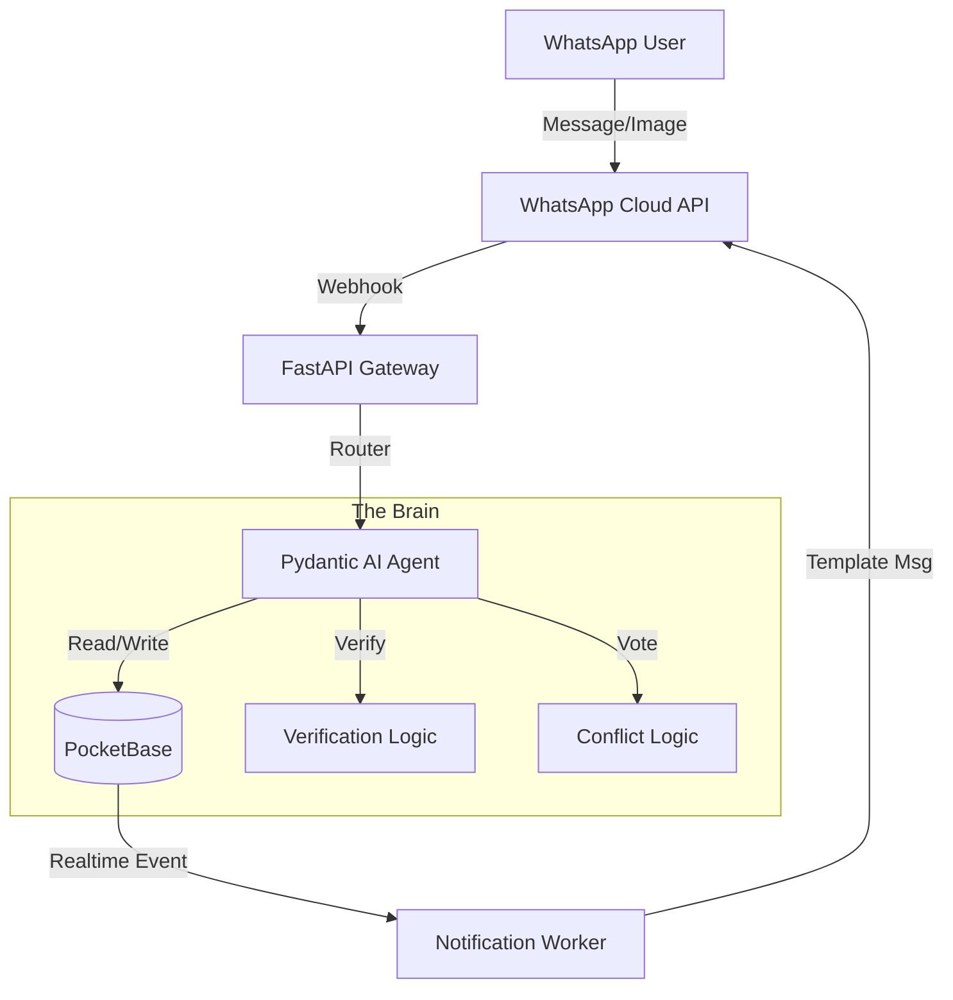

# WhatsApp HomeBoss (Bozeman)

**HomeBase** is a "firm but fair" House Manager bot that lives in your WhatsApp group. It assigns chores, enforces verification, and resolves disputes using a math-based jury system.

It is designed to remove the social friction of asking "Did you take out the trash?" by outsourcing the nagging to a neutral AI agent.

## Tech Stack (The "Indie Stack")

*   **Language:** Python 3.12+
*   **API Framework:** FastAPI
*   **Database:** PocketBase (SQLite + Go, deployed as a single binary)
*   **AI Logic:** Pydantic AI (Router/Tool pattern)
*   **Observability:** Pydantic Logfire
*   **LLM Provider:** OpenRouter (Claude 3.5 Sonnet / GPT-4o)
*   **Infrastructure:** Railway (Service-to-Service networking)

## Architecture Overview



## Repository Structure

```text
.
├── app/
│   ├── agents/         # Pydantic AI Agents & Prompts
│   ├── api/            # FastAPI Routers (Webhooks, Admin)
│   ├── core/           # Config, Logging, Security
│   ├── models/         # Pydantic Data Models (Shared)
│   ├── services/       # Business Logic (Auditor, Jury, Ledger)
│   └── main.py         # App Entrypoint
├── tests/              # Pytest Suite
└── docs/               # ADRs and Architecture notes
```

## Key Protocols (ADRs)

The core logic is defined in our Architecture Decision Records in `docs/adrs/`:

*   **[ADR 001](./docs/adrs/001-stack.md):** Why we chose Python + PocketBase.
*   **[ADR 002](./docs/adrs/002-agents.md):** Why we use Pydantic AI over LangChain.
*   **[ADR 003](./docs/adrs/003-verification.md):** The "Mandatory Verification" state machine.
*   **[ADR 004](./docs/adrs/004-conflict.md):** The "Math-Based Jury" for resolving disputes.

## Getting Started (Dev)

### Prerequisites
1.  **uv** (The Python package manager)
2.  PocketBase executable (or Docker container)
3.  OpenRouter API Key
4.  WhatsApp Business API Account (Meta Developers)

### Installation
```bash
# 1. Clone repo
git clone ...

# 2. Install dependencies
uv sync

# 3. Start PocketBase
./pocketbase serve

# 4. Start API
uv run fastapi dev app/main.py
```
